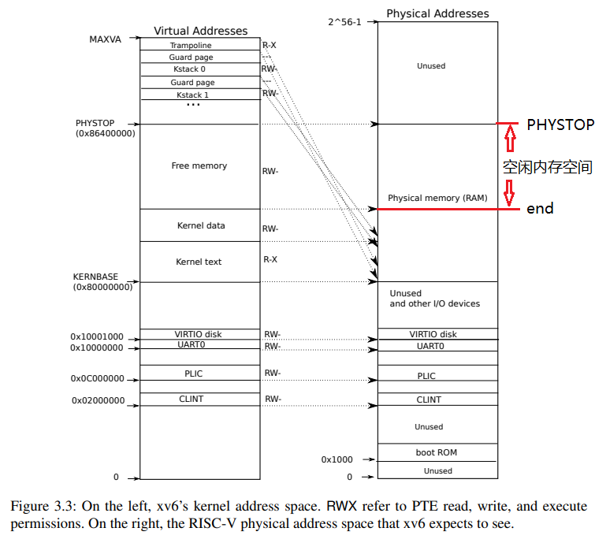

## 实验 lock

### 回答问题

#### 内存分配器

1. 什么是内存分配器？它的作用是？

   > 
   >
   > 内存分配器是操作系统用于管理上图所示的空闲地址空间的分配的程序。在物理内存中，内核在 `Kernel data` 到 `PHYSTOP` 的位置专门为用户和部分内核的应用程序划分了一段可以被分配的内存空间，内存分配器可以管理这一部分空间的使用，管理某一块内存块是否被占用等。

2. 内存分配器的数据结构是什么？它有哪些操作（函数），分别完成了什么功能？

   > 内存分配器的数据结构是链表。可以调用 `kalloc()` 分配一块内存，`kfree()` 释放一块内存，`kinit()` 初始化内存分配器。

3. 为什么指导书提及的优化方法可以提升性能？

   > 当多个核心同时访问内存时，如果使用暂未优化的方法，由于物理内存是在多进程之间共享的，所以不管是分配还是释放页面，每次操作内存分配器的链表都需要申请 `kmem.lock` 这个全局自旋锁，造成每次只能有一个 CPU 核心访问内存，这造成了性能的损失。
   >
   > 使用了指导书提及的优化方法之后，每个 CPU 对应一个锁，将原来单个链表分割为 N 个链表，使得 CPU 访问内存不再需要申请全局自旋锁而只需要申请对应链表的自旋锁，提高了程序的并行性，从而提升了性能。

#### 磁盘缓存

1. 什么是磁盘缓存？它的作用是？

   > 磁盘缓存是操作系统在内存中建立的对磁盘内容的暂时储存，是对磁盘读取的加速手段，能够利用内存快于磁盘的特性加速对磁盘内容的读写操作。

2. `buf` 结构体为什么有 `prev` 和 `next` 两个成员，而不是只保留其中一个？请从这样做的优点分析（提示：结合通过这两种指针遍历链表的具体场景进行思考）。

   > 在遍历寻找当前已缓存内容时，使用 `next` 遍历整个链表，但是在找不到当前缓存内容需要使用一个新的缓存块的时候就需要使用 `prev` 遍历链表。
   >
   > 最近被 `brelse()` 的缓存块被插入到链表头，靠近列表尾部的位置就是最不常被访问的块。查询内容时使用 `next` 从头部到尾部遍历，统计学上找到数据的时间相比从尾部遍历要短；而查找空闲缓存块需要的是最不常被访问的空闲块，所以从尾部向头部访问查找相比从头部查找需要的时间要少，所以使用 `prev` 遍历。

3. 为什么哈希表可以提升磁盘缓存的性能？可以使用内存分配器的优化方法优化磁盘缓存吗？请说明原因。

   > 使用哈希表，将对磁盘的不同的读写比较平均地分配到不同的自旋锁上进行管理，能够提高系统的并行运行程度从而提升运行效率。
   >
   > 如果使用内存分配器的优化方法优化磁盘缓存，即使用自旋锁和运行进程一一对应的方法管理锁和资源，则会有以下问题：
   >
   > 1. 锁的数量不固定，则每次添加删除进程的时候都需要一个管理锁列表的全局锁，限制整个系统的性能
   > 2. 进程数量很多，系统的锁的可用数量很可能不够用
   > 3. 如果不同的进程之间使用相同的 `block`，将造成一个缓存块在不同的锁管理的链表中反复转移，或者反复多次读写磁盘，或者造成缓存和磁盘的数据一致性问题
   >
   > 所以不能使用内存分配器的优化方法对 `bcache` 进行优化，还需要一个 `hash()` 函数对请求参数进行一轮分配。

### 内存分配器

将原来代码中的 `kmem.lock` 这一全局自旋锁修改为按照 CPU 分配的局部自旋锁。

复制 `NCPU` 份自旋锁和链表结构。

```C
struct {
  struct spinlock lock;
  struct run *freelist;
} kmem[NCPU];
```

在 `Makefile` 内将当前编译的 CPU 核心数量传递到代码内。

```make
ifndef CPUS
CPUS := 3
endif
ifeq ($(LAB),fs)
CPUS := 1
endif
CFLAGS += -DCPUS=$(CPUS)
```

每个核心都调用一次 `kinit()`。

```C
// start() jumps here in supervisor mode on all CPUs.
void main() {
  if (cpuid() == 0) {
    // ... 
    kinit();             // physical page allocator
    // ...
    __sync_synchronize();
    started = 1;
  } else {
    while (started == 0)
      ;
    // also init kmem
    kinit();
    __sync_synchronize();
    // ...
  }
  scheduler();
}
```

将可用内存平均分为 `CPUS` 份，每个 CPU 占用 1 份，调用 `kinit()` 时初始化自己的那一份。

```C
void kinit() {
  if (cpuid() != 0) {
    IFNDEF(KMEM_SPLIT, return );
  }
  const char lock_name_const[] = "kmem_hart ";
  char lock_name[sizeof(lock_name_const)];
  for (int i = 0; i < sizeof(lock_name_const); i++) {
    lock_name[i] = lock_name_const[i];
  }
  int cid = MUXDEF(KMEM_SPLIT, cpuid(), 0);
  IFDEF(KMEM_SPLIT, lock_name[9] = cid + '0');
  initlock(&kmem[cid].lock, lock_name);
  Log("cpu[%d] lock init: %s; cpu %d", cid, lock_name, cid);
  uint64 size = ((uint64)PHYSTOP - (uint64)end) / KMEM_CPUS;
  freerange(end + size * cid, end + size * (cid + 1));
  Log("KMEM: [%p - %p], cpu %d [%p - %p], PAGES [%x/%x]", 
      end, PHYSTOP, cid, end + size * cid, end + size * (cid + 1),
      size / PGSIZE, ((uint64)PHYSTOP - (uint64)end) / PGSIZE);
}
```

由于每个 CPU 都有权利访问所有的内存，所以当 CPU 对应链表内的可用内存消耗完毕后，继续申请内存就需要从其他 CPU “窃取”。

```C
// Allocate one 4096-byte page of physical memory.
// Returns a pointer that the kernel can use.
// Returns 0 if the memory cannot be allocated.
void *kalloc(void) {
  struct run *r;

  int cid = MUXDEF(KMEM_SPLIT, cpuid(), 0);
  acquire(&kmem[cid].lock);
  r = kmem[cid].freelist;
  if (r) kmem[cid].freelist = r->next;
  release(&kmem[cid].lock);
  if (!r) {
    // "steal" part of other CPU's freelist
    // lock in order
    for (int i = 0; i < KMEM_CPUS; i++) acquire(&kmem[i].lock);
    for (int i = 0; i < KMEM_CPUS; i++) {
      r = kmem[i].freelist;
      if (r) {
        kmem[i].freelist = r->next;
        break;
      }
    }
    for (int i = KMEM_CPUS - 1; i >= 0; i--) release(&kmem[i].lock);
  }

  if (r) memset((char *)r, 5, PGSIZE);  // fill with junk
  return (void *)r;
}
```

### 磁盘缓存

修改磁盘缓存块列表的管理机制，使得可用多个锁管理缓存块，从而减少缓存块管理的锁争用。

基本思路非常简单，直接将原本的锁和锁管理的缓存块列表复制 N 份即可。这样做维护的是单个哈希桶内的链表 LRU 而非全局 LRU，为的就是减少全局锁的争用，同时尽量减少 LRU 的维护成本。使用链表维护的 LRU 每次修改只需要 O(1) 的时间复杂度，相比使用时间戳的方法（O(N)）好上一些。

在 `params.h` 中添加了修改需要的参数，分别表示是否使用多个锁和锁的个数。

```C
// Split kmem to every cpu cores
#define KMEM_SPLIT 1

// Split block cache locks
#define BIO_SPLIT_LOCK 1
// Split block cache into N groups
#define BIO_N 9
```

修改 `bcache` 结构，添加多个锁 `lock_bucket[BIO_n]` 和链表头 `head[BIO_N][NBUF]` 以及多个缓存块 `buf[BIO_N][NBUF]`：

```C
struct {
  struct spinlock lock;
  IFDEF(BIO_SPLIT_LOCK, struct spinlock lock_bucket[BIO_N]);
  struct buf buf IFDEF(BIO_SPLIT_LOCK, [BIO_N])[NBUF];
  struct buf head IFDEF(BIO_SPLIT_LOCK, [BIO_N]);
} bcache;
```

添加一些宏便于程序书写：

```C
// print log
// #define BIO_LOG 1

#ifdef BIO_LOG
#define LOCK_GRP_LOG Log("\t  LOCK_GRP(%d)", hash)
#define UNLOCK_GRP_LOG Log("\tUNLOCK_GRP(%d)", hash)
#else
#define LOCK_GRP_LOG
#define UNLOCK_GRP_LOG
#endif
#define DEF_HASH IFDEF(BIO_SPLIT_LOCK, int hash = b->blockno % BIO_N)

#define LOCK_ALL_F acquire(&bcache.lock)
#define UNLOCK_ALL_F release(&bcache.lock)

#define OPHASH IFDEF(BIO_SPLIT_LOCK, [hash])

#define LOCK_ALL IFNDEF(BIO_SPLIT_LOCK, LOCK_ALL_F)
#define UNLOCK_ALL IFNDEF(BIO_SPLIT_LOCK, UNLOCK_ALL_F)

#define LOCK_GRP                                               \
  do {                                                         \
    IFDEF(BIO_SPLIT_LOCK, acquire(&bcache.lock_bucket[hash])); \
    LOCK_GRP_LOG;                                              \
  } while (0)
#define UNLOCK_GRP                                             \
  do {                                                         \
    UNLOCK_GRP_LOG;                                            \
    IFDEF(BIO_SPLIT_LOCK, release(&bcache.lock_bucket[hash])); \
  } while (0)
```

在 `binit()` 中初始化多个锁：

```C
void binit(void) {
  initlock(&bcache.lock, "bcache");
#ifdef BIO_SPLIT_LOCK
  char name_grp[256];
  for (int i = 0; i < BIO_N; i++) {
    snprintf(name_grp, sizeof(name_grp), "bcache_bucket_%d", i);
    // Log("init lock %s", name_grp);
    initlock(&bcache.lock_bucket[i], name_grp);
  }
#endif
    // ...
```

在 `bget()` 中，每次只锁定当前哈希组的自旋锁。其中 `LOCK_ALL` 在 未定义 `BIO_SPLIT_LOCK` 时会锁定 `bcache.lock`，`LOCK_GRP` 在定义了 `BIO_SPLIT_LOCK` 时会锁定当前组的自旋锁。`UNLOCK_*` 同理。`OPHASH` 依照是否定义 `BIO_SPLIT_LOCK` 决定访问当前组的列表还是全局的列表。

```C
// Look through buffer cache for block on device dev.
// If not found, allocate a buffer.
// In either case, return locked buffer.
static struct buf *bget(uint dev, uint blockno) {
  struct buf *b;

  LOCK_ALL;

  IFDEF(BIO_SPLIT_LOCK, int hash = blockno % BIO_N);
  // Is the block already cached?
  struct buf *iter;
  for (b = bcache.head OPHASH.next; b != &bcache.head OPHASH; b = iter) {
    LOCK_GRP;
    if (b->dev == dev && b->blockno == blockno) {
      b->refcnt++;
      struct sleeplock *lock = &b->lock;
      UNLOCK_GRP;
      UNLOCK_ALL;
      acquiresleep(lock);
      return b;
    }
    iter = b->next;
    Assert(iter != b, "Dead loop! ticks: %d", ticks);
    UNLOCK_GRP;
  }

  // Not cached.
  // Recycle the least recently used (LRU) unused buffer.
  for (b = bcache.head OPHASH.prev; b != &bcache.head OPHASH; b = iter) {
    LOCK_GRP;
    if (b->refcnt == 0) {
      b->dev = dev;
      b->blockno = blockno;
      b->valid = 0;
      b->refcnt = 1;
      struct sleeplock *lock = &b->lock;
      UNLOCK_GRP;
      UNLOCK_ALL;
      acquiresleep(lock);
      return b;
    }
    iter = b->prev;
    Assert(iter != b, "Dead loop! ticks: %d", ticks);
    UNLOCK_GRP;
  }
  panic("bget: no buffers");
}
```

`brelse()` 函数修改理由同上。

```C
// Release a locked buffer.
// Move to the head of the most-recently-used list.
void brelse(struct buf *b) {
  if (!holdingsleep(&b->lock)) panic("brelse");

  releasesleep(&b->lock);

  DEF_HASH;
  LOCK_ALL;
  LOCK_GRP;
  b->refcnt--;
  if (b->refcnt == 0) {
    // no one is waiting for it.
    b->next->prev = b->prev;
    b->prev->next = b->next;
    b->next = bcache.head OPHASH.next;
    b->prev = &bcache.head OPHASH;
    bcache.head OPHASH.next->prev = b;
    bcache.head OPHASH.next = b;
  }
  UNLOCK_ALL;
  UNLOCK_GRP;
}
```

`b[un]pin()` 也需要将全局锁改变为局部锁。

```C
void bpin(struct buf *b) {
  DEF_HASH;
  LOCK_GRP;
  LOCK_ALL;
  b->refcnt++;
  UNLOCK_ALL;
  UNLOCK_GRP;
}
void bunpin(struct buf *b) {
  DEF_HASH;
  LOCK_GRP;
  LOCK_ALL;
  b->refcnt--;
  UNLOCK_ALL;
  UNLOCK_GRP;
}
```

### 实验结果

运行 `bcachetest`

```sh
$ make qemu

xv6 kernel is booting

[kernel/kalloc.c:41 kinit] cpu[0] lock init: kmem_hart0; cpu 0
[kernel/kalloc.c:44 kinit] KMEM: [0x000000008005c028 - 0x0000000088000000], cpu 0 [0x000000008005c028 - 0x0000000082ae801a], PAGES [2a8b/7fa3]
[kernel/kalloc.c:41 kinit] cpu[1] lock init: kmem_hart1; cpu 1
[kernel/kalloc.c:41 kinit] cpu[2] lock init: kmem_hart2; cpu 2
page table 0x0000000082a57000
||0: pte 0x0000000020a94c01 pa 0x0000000082a53000
|| ||0: pte 0x0000000020a94801 pa 0x0000000082a52000
|| || ||0: pte 0x0000000020a9501f pa 0x0000000082a54000
|| || ||1: pte 0x0000000020a9440f pa 0x0000000082a51000
|| || ||2: pte 0x0000000020a9401f pa 0x0000000082a50000
||255: pte 0x0000000020a95801 pa 0x0000000082a56000
|| ||511: pte 0x0000000020a95401 pa 0x0000000082a55000
|| || ||510: pte 0x0000000020a97c07 pa 0x0000000082a5f000
|| || ||511: pte 0x0000000020001c0b pa 0x0000000080007000
[kernel/kalloc.c:44 kinit] KMEM: [0x000000008005c028 - 0x0000000088000000], cpu 1 [0x0000000082ae801a - 0x000000008557400c], PAGES [2a8b/7fa3]
hart 1 starting [2/3]
[kernel/kalloc.c:44 kinit] KMEM: [0x000000008005c028 - 0x0000000088000000], cpu 2 [0x000000008557400c - 0x0000000087fffffe], PAGES [2a8b/7fa3]
hart 2 starting [3/3]
init: starting sh
[user/sh.c:176 execute_shrc] Open file /.shrc, fd=3
LAB=lock
$ bcachetest
start test0
test0 results:
--- lock kmem/bcache stats
lock: bcache: #fetch-and-add 0 #acquire() 9145
lock: bcache: #fetch-and-add 0 #acquire() 6853
lock: bcache: #fetch-and-add 0 #acquire() 11693
lock: bcache: #fetch-and-add 0 #acquire() 7051
lock: bcache: #fetch-and-add 0 #acquire() 8930
lock: bcache: #fetch-and-add 0 #acquire() 7123
lock: bcache: #fetch-and-add 0 #acquire() 6975
lock: bcache: #fetch-and-add 0 #acquire() 7358
lock: bcache: #fetch-and-add 0 #acquire() 6852
--- top 5 contended locks:
lock: virtio_disk: #fetch-and-add 240767 #acquire() 1122
lock: proc: #fetch-and-add 36569 #acquire() 76337
lock: uart: #fetch-and-add 9233 #acquire() 308
lock: proc: #fetch-and-add 9009 #acquire() 76008
lock: proc: #fetch-and-add 5879 #acquire() 76026
tot= 0
test0: OK
start test1
test1 OK
$ 
```

运行 `kalloctest`

```sh
$ kalloctest
start test1
test1 results:
--- lock kmem/bcache stats
lock: bcache: #fetch-and-add 0 #acquire() 26001
lock: bcache: #fetch-and-add 0 #acquire() 21450
lock: bcache: #fetch-and-add 137 #acquire() 45612
lock: bcache: #fetch-and-add 0 #acquire() 22129
lock: bcache: #fetch-and-add 0 #acquire() 24008
lock: bcache: #fetch-and-add 0 #acquire() 24988
lock: bcache: #fetch-and-add 0 #acquire() 24666
lock: bcache: #fetch-and-add 95 #acquire() 26312
lock: bcache: #fetch-and-add 0 #acquire() 39588
--- top 5 contended locks:
lock: virtio_disk: #fetch-and-add 993917 #acquire() 4500
lock: proc: #fetch-and-add 87981 #acquire() 329510
lock: proc: #fetch-and-add 52001 #acquire() 328064
lock: proc: #fetch-and-add 30441 #acquire() 328026
lock: proc: #fetch-and-add 28081 #acquire() 328027
tot= 232
test1 OK
start test2
total free number of pages: 32428 (out of 32768)
.....
test2 OK
$ 
```

评分

```sh
$ make grade

# 编译输出等...

$ make qemu-gdb
(145.9s) 
== Test   kalloctest: test1 == 
  kalloctest: test1: OK 
== Test   kalloctest: test2 == 
  kalloctest: test2: OK 
== Test kalloctest: sbrkmuch == 
$ make qemu-gdb
kalloctest: sbrkmuch: OK (15.8s) 
== Test running bcachetest == 
$ make qemu-gdb
(8.6s) 
== Test   bcachetest: test0 == 
  bcachetest: test0: OK 
== Test   bcachetest: test1 == 
  bcachetest: test1: OK 
== Test usertests == 
$ make qemu-gdb
usertests: OK (207.5s) 
== Test time == 
time: OK 
Score: 70/70
```

