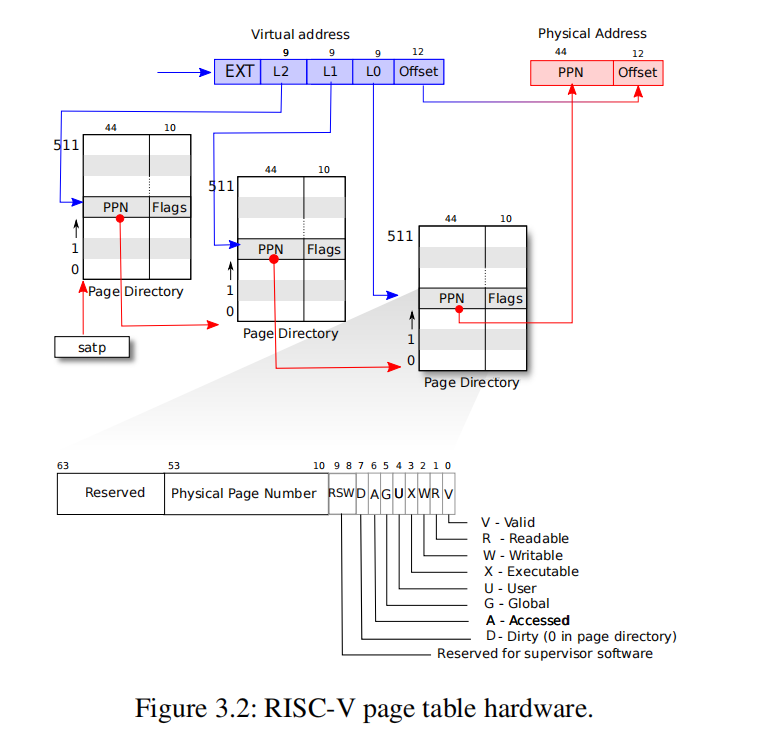
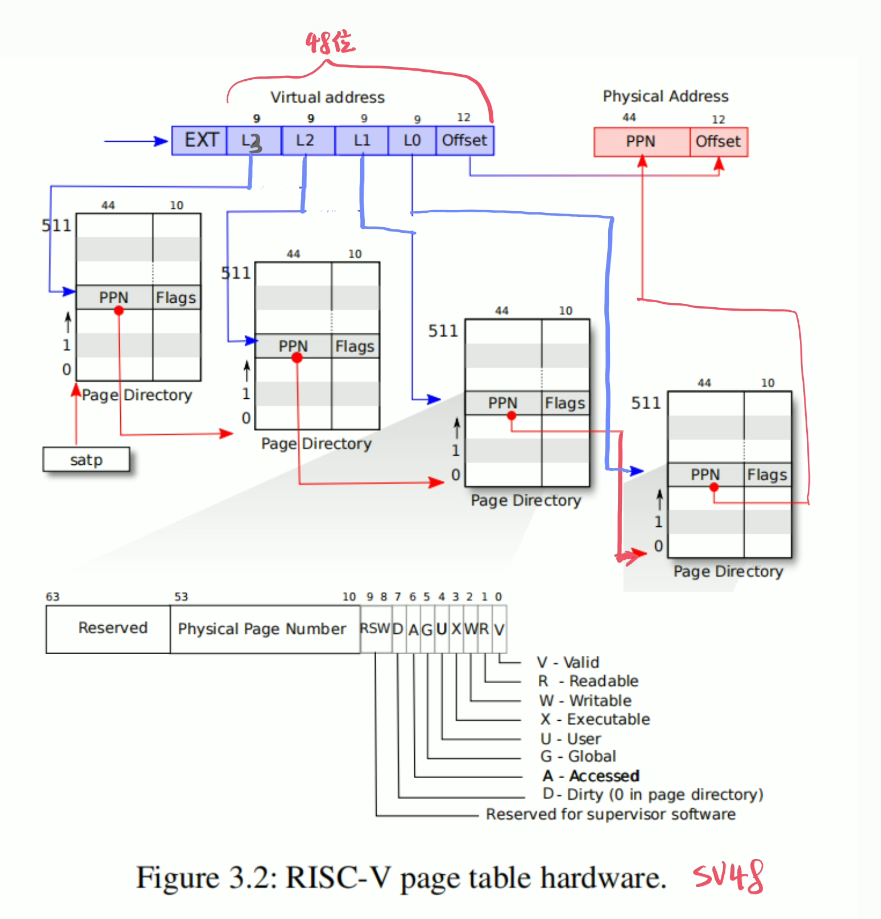
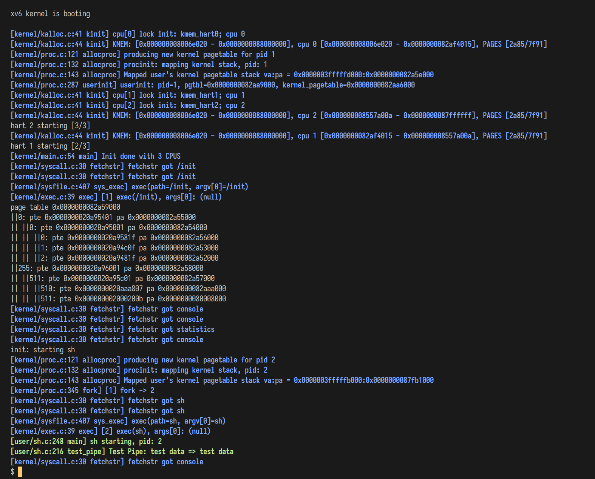
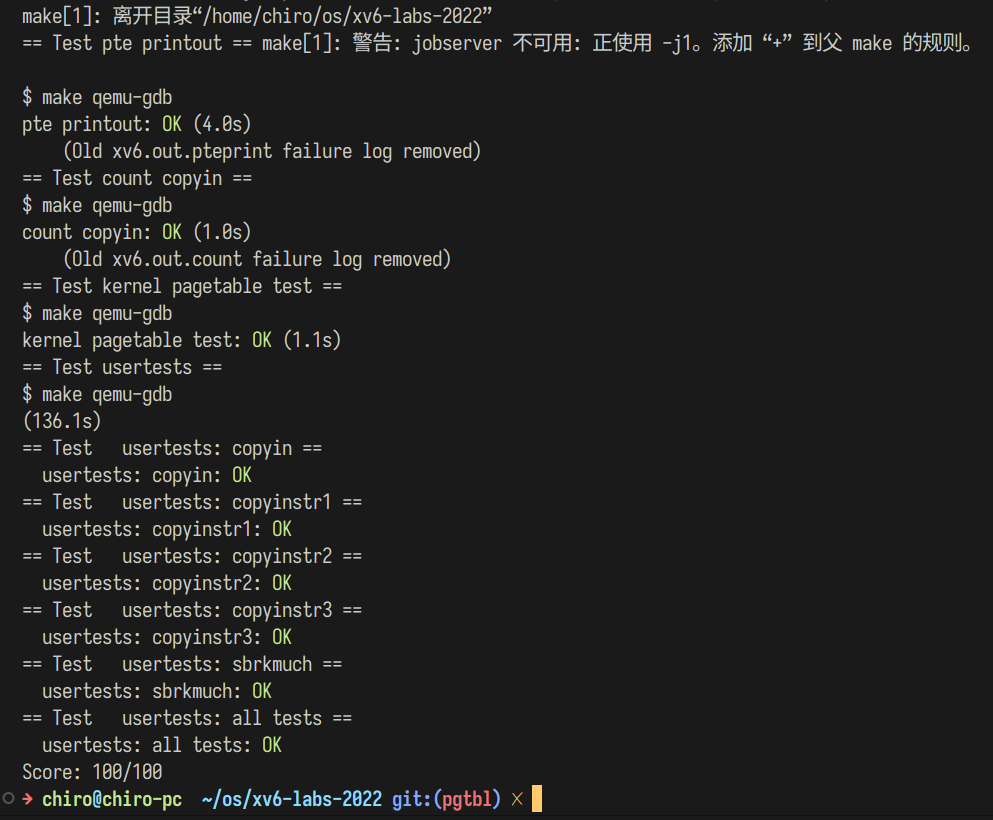

## 实验 pgtbl

### 回答问题

1. 查阅资料，简要阐述页表机制为什么会被发明，它有什么好处？

   > 在早期的计算机系统中，页表尚不存在，统一使用同一个地址空间，系统、不同进程同时使用使用物理内存。这是十分自然的做法，但是随着计算机系统的发展，计算机系统有了更多的任务，例如隔离系统和用户的内存访问以保护用户数据和系统机密数据，于是虚拟内存这一概念就因此而被提出了。
   >
   > 用户程序看到的地址空间是一个虚拟的地址空间，一般情况下并不能直接访问到物理内存，访存的地址需要通过一个地址映射转换过程才能完成访存动作，地址映射过程（内存管理过程）分为多种，包含分页、分段、段页式等，其中出现的页表这一结构储存了地址映射的信息，帮助系统完成了虚实地址转换过程。
   >
   > 页表的出现使得用户与系统之间、进程与进程之间通过虚拟内存完成了内存隔离，增强了系统的安全性。同时，页表十分适合硬件实现，与页表相关的 TLB 即可看作一个页表项的缓存，硬件上加速了虚实地址转换过程。此外，使用页表方式管理内存还能够更加高效地使用内存，减少内存碎片。

2. 按照步骤，阐述 SV39 标准下，给定一个64位虚拟地址为 `0x123456789ABCDEF` 的时候，是如何一步一步得到最终的物理地址的？（页表内容可以自行假设）

   > 参考下方的 SV39 图，解析虚拟地址。
   >
   > `offset = 0xDEF`, `L0 = 0_1011_1100 = 0xBC`, `L1 = 0_0100_1101 = 0x4D`, `L2 = 1_1001_1110 = 0x19E`
   >
   > 1. 首先从 `stap` CSR 中取出当前页表的储存地址，存入 `uint64_t pagetable`
   > 2. `pagetable` 实际上是一个 512 项的 PTE 数组 `pagetable[index]`，对应索引 `index` 即为 `Lx, x=2,1,0`
   > 3. 取出第三级的 PTE `pagetable[L2]`，取其高 44 位就是第三级的 PPN `ppn3`
   > 4. 将 PPN 左移 12 位，得到下一级页表物理地址
   > 5. 重复 3-4，得到第一级 PPN `ppn1`。过程中需要检查 Flags，如果页表区域当前没有权限访问应当返回失败
   > 6. 将第一级 PPN 与 `offset` 相连，得到物理地址，即 `pa = ppn1<<12 + offset`
   >
   > 所以解析得到的物理地址应该为
   >
   > ```c
   > #define PPN(x) (x>>10)
   > PPN(PPN(PPN(pagetable[L2])[L1])[L0])<<12 + offset
   > ```

3. 我们注意到，虚拟地址的 L2, L1, L0 均为9位。这实际上是设计中的必然结果，它们只能是9位，不能是10位或者是8位，你能说出其中的理由吗？（提示：一个页目录的大小必须与页的大小等大）

   > 对页表的索引使用了 9 位的 Lx，一个 PTE 大小为 64 bit，则一个页表大小就为 $2^9\times 8 = 4096 B = 2^{12}B$，一个页表储存大小正好就是一页大小。设 $Lx = x,Offset=2^l$，$S=8\times2^{x}=2^{x+3},$ 如果要使得页表能够正好使用一页大小而不浪费空间，需要 $l=x+3\and l+3\times x <= 64$。如果我们固定选择页大小为 4KiB，则 $2^l=4096B,l=12,x=9$。

4. 在“实验原理”部分，我们知道 SV39 中的 39 是什么意思。但是其实还有一种标准，叫做 SV48，采用了四级页表而非三级页表，你能模仿“实验原理”部分示意图，画出 SV48 页表的数据结构和翻译的模式图示吗？（ SV39 原图如下）

   

   > SV39 意为使用了虚地址的低 39 位来储存页表信息，$39=9\times 3+12$，当使用 SV48，就是增加了一级页表，使用位数增加 9 位。修改上图后得到 SV48 图示：
   >
   > 

### 打印页表

打印页表比较简单，只需要将上面思考题中提到的页表翻译过程实现一遍，每一级遍历 0-511 的 PPN 即可遍历整个页表。

```c
#define PTE_VALID(pte) \
  if (!(pte & PTE_V)) continue;

void vmprint(pagetable_t pagetable) {
  printf("page table %p\n", pagetable);
  for (uint64 vppn0 = 0; vppn0 < 256; vppn0++) {
    pte_t pte0 = pagetable[vppn0];
    PTE_VALID(pte0)
    printf("||%d: pte %p pa %p\n", vppn0, pte0, PTE2PA(pte0));
    for (uint64 vppn1 = 0; vppn1 < 512; vppn1++) {
      pte_t pte1 = ((pagetable_t)(PTE2PA(pte0)))[vppn1];
      PTE_VALID(pte1)
      printf("|| ||%d: pte %p pa %p\n", vppn1, pte1, PTE2PA(pte1));
      for (uint64 vppn2 = 0; vppn2 < 512; vppn2++) {
        pte_t pte2 = ((pagetable_t)(PTE2PA(pte1)))[vppn2];
        PTE_VALID(pte2)
        printf("|| || ||%d: pte %p pa %p\n", vppn2, pte2, PTE2PA(pte2));
      }
    }
  }
}
```

包含系统页表打印过程的启动 log：



### 独立内核页表

在这一实验中，我们需要将共享内核页表改成独立内核页表。在未修改的 xv6 os 中，系统和应用软件共享一个页表，但是为了保证进程之间的内存隔离，保证每个进程拥有自己独立的内核页表是必要的。

**Step 1：**在 `proc.h` 的 PCB 中添加了两个新成员 `kstack_pa` 和 `k_pagetable`。

```c
// Per-process state
struct proc {
  uint64 kstack;                // Virtual address of kernel stack
  uint64 kstack_pa;             // PA of kernel stack
  pagetable_t k_pagetable;      // Kernel page table
  pagetable_t pagetable;        // User page table
};
```

**Step 2：**创建进程内核页表。

考虑到系统的内核页表和进程内核页表初始化时大部分映射是一致的，我使用了一个共享的函数创建页表，在 `kvminit()` 中再额外映射 `CLINT` 区域。

```c
void pkvmmap(pagetable_t pagetable, uint64 va, uint64 pa, uint64 sz, int perm) {
  if (mappages(pagetable, va, sz, pa, perm) != 0) panic("pkvmmap");
}

pagetable_t vmcreate() {
  pagetable_t pagetable = (pagetable_t)kalloc();
  if (pagetable == 0) return 0;
  memset(pagetable, 0, PGSIZE);

  // uart registers
  pkvmmap(pagetable, UART0, UART0, PGSIZE, PTE_R | PTE_W);

  // virtio mmio disk interface
  pkvmmap(pagetable, VIRTIO0, VIRTIO0, PGSIZE, PTE_R | PTE_W);

  // CLINT: Donot map me! do it at allocproc
  // pkvmmap(pagetable, CLINT, CLINT, 0x10000, PTE_R | PTE_W);

  // PLIC
  pkvmmap(pagetable, PLIC, PLIC, 0x400000, PTE_R | PTE_W);

  // map kernel text executable and read-only.
  pkvmmap(pagetable, KERNBASE, KERNBASE, (uint64)etext - KERNBASE,
          PTE_R | PTE_X);

  // map kernel data and the physical RAM we'll make use of.
  pkvmmap(pagetable, (uint64)etext, (uint64)etext, PHYSTOP - (uint64)etext,
          PTE_R | PTE_W);

  // map the trampoline for trap entry/exit to
  // the highest virtual address in the kernel.
  pkvmmap(pagetable, TRAMPOLINE, (uint64)trampoline, PGSIZE, PTE_R | PTE_X);

  return pagetable;
}

pagetable_t pkvminit() { return vmcreate(); }

/*
 * create a direct-map page table for the kernel.
 */
void kvminit() {
  kernel_pagetable = vmcreate();

  kvmmap(CLINT, CLINT, 0x10000, PTE_R | PTE_W);
}
```

**Step 3：**修改 `procinit()`

在这里我采用了一种动态分配每个进程的内核栈的方法，将进程的内核栈分配和映射挪到创建进程 PCB 的时候完成（`allocproc()`）。这样的话释放当前进程的时候还需要释放对应的内核栈，但是更加符合操作系统的实际运行情况。

```c
// initialize the proc table at boot time.
void procinit(void) {
  struct proc *p;

  initlock(&pid_lock, "nextpid");
  for (p = proc; p < &proc[NPROC]; p++) {
    initlock(&p->lock, "proc");
    // Remove kernel stack mapping to kernel pagetable,
    // do it when create proc
  }
  kvminithart();
}
```

**Step 4：**修改 `allocproc()`

在此函数中分配了内核栈的内存以及在进程内核页表中添加了内核栈的映射，在系统页表中就不保留进程内核栈的映射了。

```c
  // produce a new pagetable of user's kernel_pagetable
  Dbg("producing new kernel pagetable for pid %d", p->pid);
  p->k_pagetable = pkvminit();
  if (p->k_pagetable == 0) {
    freeproc(p);
    release(&p->lock);
    return 0;
  }

  p->kstack_pa = (uint64)kalloc();
  if (p->kstack_pa == 0) panic("kalloc");
  p->kstack = KSTACK((int)(p - proc));
  if (p->pid != 0) Dbg("procinit: mapping kernel stack, pid: %d", p->pid);
  Dbg("Mapped user's kernel pagetable stack va:pa = %p:%p", p->kstack,
      p->kstack_pa);
  pkvmmap(p->k_pagetable, p->kstack, p->kstack_pa, PGSIZE, PTE_R | PTE_W);
```

**Step 5：**修改调度器，切换进程的时候同时切换内核页表

```c
        // ...
        // Switch to chosen process.  It is the process's job
        // to release its lock and then reacquire it
        // before jumping back to us.
        p->state = RUNNING;
        c->proc = p;
        // switch to user pagetable
        pkvminithart(p->k_pagetable);
        show_context(&c->context);
        show_context(&p->context);
        swtch(&c->context, &p->context);
        kvminithart();
        
        // Process is done running for now.
        // It should have changed its p->state before coming back.
        c->proc = 0;
        // ...
```

```c
// Switch h/w page table register to the kernel's page table,
// and enable paging.
void kvminithart() {
  w_satp(MAKE_SATP(kernel_pagetable));
  sfence_vma();
}
```

这里要注意从 switch 返回后应当切换回系统页表。

**Step 6：**释放进程内核页表

```c
// Free a process's kernel page table, but need not free the physical memory it
// refers to
void proc_free_kernel_pagetable(pagetable_t pagetable) {
  for (int i = 0; i < 512; i++) {
    pte_t pte0 = pagetable[i];
    if (pte0 & PTE_V) {
      pagetable_t pgtbl1 = (pagetable_t)(PTE2PA(pte0));
      for (int j = 0; j < 512; j++) {
        pte_t pte1 = pgtbl1[j];
        if (pte1 & PTE_V) {
          pagetable_t pgtbl2 = (pagetable_t)(PTE2PA(pte1));
          kfree((void *)pgtbl2);
        }
      }
      kfree((void *)pgtbl1);
    }
  }
  kfree((void *)pagetable);
}
```

```c
// free a proc structure and the data hanging from it,
// including user pages.
// p->lock must be held.
static void freeproc(struct proc *p) {
  if (p->trapframe) kfree((void *)p->trapframe);
  p->trapframe = 0;
  if (p->pagetable) proc_freepagetable(p->pagetable, p->sz);
  if (p->k_pagetable) {
    proc_free_kernel_pagetable(p->k_pagetable);
    p->k_pagetable = 0;
  }
  if (p->kstack_pa) {
    kfree((void *)p->kstack_pa);
    p->kstack_pa = 0;
  }
  p->pagetable = 0;
  p->k_pagetable = 0;
  p->sz = 0;
  p->pid = 0;
  p->parent = 0;
  p->name[0] = 0;
  p->chan = 0;
  p->killed = 0;
  p->xstate = 0;
  p->state = UNUSED;
}
```

`proc_free_kernel_pagetable` 里释放了 `k_pagetable`，采用遍历的方式取消了其所有映射，但是不释放其指向的物理页帧，防止释放掉其他进程依赖的物理页，之后再释放掉页表本身。

`freeproc()` 调用了 `proc_free_kernel_pagetable`，然后释放了进程的内核栈。

### 简化软件模拟地址翻译

我们先查看 `vmcopyin.c` 中的 `copyin*_new()`，

```c
// Copy from user to kernel.
// Copy len bytes to dst from virtual address srcva in a given page table.
// Return 0 on success, -1 on error.
int copyin_new(pagetable_t pagetable, char *dst, uint64 srcva, uint64 len) {
  struct proc *p = myproc();

  if (srcva >= p->sz || srcva + len >= p->sz || srcva + len < srcva) {
    Dbg("copyin_new: invalid args! dst=%p, srcva=%p, len=%d, p->sz=%d", dst, srcva, len, p->sz);
    if (srcva + len >= p->sz) {
      Dbg("srcva + len >= p->sz!, srcva(%d) + len(%d) >= p->sz(%d)", srcva, len, p->sz);
    }
    return -1;
  }
  memmove((void *)dst, (void *)srcva, len);
  stats.ncopyin++;  // XXX lock
  return 0;
}

// Copy a null-terminated string from user to kernel.
// Copy bytes to dst from virtual address srcva in a given page table,
// until a '\0', or max.
// Return 0 on success, -1 on error.
int copyinstr_new(pagetable_t pagetable, char *dst, uint64 srcva, uint64 max) {
  struct proc *p = myproc();
  char *s = (char *)srcva;

  stats.ncopyinstr++;  // XXX lock
  for (int i = 0; i < max && srcva + i < p->sz; i++) {
    dst[i] = s[i];
    if (s[i] == '\0') return 0;
  }
  return -1;
}
```

可以看到其“简化”后的访问过程，就是省略了软件的翻译过程，将用户空间内的 `char *dst` 直接看作了内核空间内的地址。这就要求在调用这一函数时，用户空间和内核空间应当是相容的，即内核页表的映射应当包含用户页表的所有映射，CPU 工作在硬件地址翻译模式下，利用硬件翻译的方式完成了地址翻译。

于是实现这一软件地址翻译过程，也就是需要在每次改变用户页表的时候同样同步到进程内核页表。

实验指导书上推荐了一种优雅的实现方法，但是考虑到回收页表的过程的复杂性暂时没采用，采用的仍然是同步修改两个页表的方式。

**Step 1：**写一个函数将用户页表映射到进程的内核页表中

```c
// Copy process's user pagetable to new kernel pagetable
int pkvmcopy(pagetable_t old, pagetable_t new, uint64 sz_old, uint64 sz_new) {
  if (sz_new > PLIC) {
    Err("Overflow to PLIC! sz_new=%p", sz_new);
    return -1;
  }
  sz_old = PGROUNDDOWN(sz_old);

  for (uint64 i = sz_old; i < sz_new; i += PGSIZE) {
    pte_t *pte_from, *pte_to;
    if ((pte_from = walk(old, i, 0)) == 0) panic("pkvmcopy: pte should exist");
    if ((pte_to = walk(new, i, 1)) == 0) panic("u2kvmcopy: walk fail");
    *pte_to = (*pte_from) & (~PTE_U);
  }
  return 0;
}
```

1. 定义地址映射到 `PLIC` 之上为非法。
2. 使用 `sz_old = PGROUNDDOWN(sz_old);` 保证地址对齐。
3. 同步的时候去掉了 `PTE_U` 标志位以保证内核的访问。

**Step 2：**使用 `copyin*_new()` 代替 `copyin*()`

```c
int copyin(pagetable_t pagetable, char *dst, uint64 srcva, uint64 len) {
#if !defined(COPYIN_USE_NEW) || 0
  // ...
#else
  return copyin_new(pagetable, dst, srcva, len);
#endif
}
```

使用宏进行切换判断，方便调试。

**Step 3：**在进程内核页表上加上用户页表的映射

也就是 **Step 1** 的去掉 `PTE_U` 的过程；指导书推荐了去掉 `sstatus` 的 `SUM` 位的方法。

**Step 4：**在独立内核页表加上用户页表的映射的时候，每一次用户页表被修改了映射的同时，都要修改对应独立内核页表的相应部分保持同步。

在 `userinit()` 中：

```c
  // allocate one user page and copy init's instructions
  // and data into it.
  uvminit(p->pagetable, initcode, sizeof(initcode));
  p->sz = PGSIZE;

  pkvmcopy(p->pagetable, p->k_pagetable, 0, p->sz);

  Log("userinit: pid=%d, pgtbl=%p, kernel_pagetable=%p", p->pid, p->pagetable,
      p->k_pagetable);
```

在 `fork()` 中：

```c
  // Copy user's kernel pagetable flags parent to child
  if (pkvmcopy(np->pagetable, np->k_pagetable, 0, np->sz) < 0) {
    freeproc(np);
    release(&np->lock);
    return -1;
  }
```

在 `exec()` 中：

```c
  pkvmdealloc(p->k_pagetable, p->sz, sz);

  // Commit to the user image.
  oldpagetable = p->pagetable;
  p->pagetable = pagetable;
  p->sz = sz;
  p->trapframe->epc = elf.entry;  // initial program counter = main
  p->trapframe->sp = sp;          // initial stack pointer
  proc_freepagetable(oldpagetable, oldsz);

  // Copy kernel pagetable
  if (pkvmcopy(p->pagetable, p->k_pagetable, 0, sz) < 0) goto bad;
```

在这里调用 `pkvmdealloc` 是为了当新的 `sz` 小于原来的 `p->sz`  的时候，取消多出来的映射。

在 `sbrk()` 中：

```c
  if (growproc(n) < 0) return -1;
  if (n > 0) {
    struct proc *p = myproc();
    pkvmcopy(p->pagetable, p->k_pagetable, addr, addr + n);
  }
```

### make grade 结果




